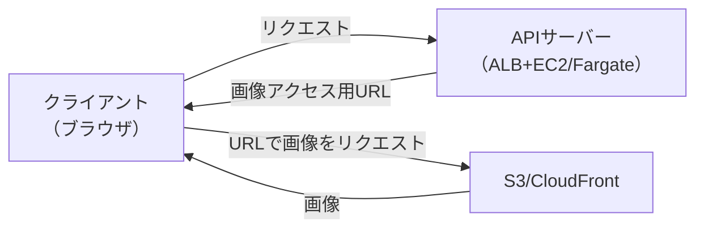

# advanced_design.md
SKILL.mdに記載した最小構成から、負荷対策やユーザビリティ向上のための以下の発展的なアプリ構成について記載

- マルチAZ構成への移行: 冗長性向上のためにマルチAZ構成に移行する方法
- 負荷が増えた場合の対応: 負荷が増えた場合にスケールアウト・スケールアップで対応する方法
- S3 Presigned URLによる画像の直接配信: 1画面に多数の画像を表示する場合に有効
- オリジナルドメインと証明書の取得: ブランディングや組織ドメイン統一に有効

## マルチAZ構成への移行
以下設定を変更することで、バックエンドのコンピューティング（ECS Fargate）とDBをマルチAZ構成に移行できる
- ECS
  - Service
    - Desired tasksを2以上に増やす
    - Turn on Availability Zone rebalancingをチェックして有効化する
    - Subnetsにもう一方のAZのプライベートサブネットを追加する
- RDS
  - Modify DB instance
    - Multi-AZ deploymentを選択する
    - Secondary AZにもう一方のAZを選択する
- VPC
  - VPC endpoints
    - com.amazonaws.ap-northeast-1.logsにもう一方のサブネット（Private Subnet 2）を追加
    - com.amazonaws.ap-northeast-1.ssmにもう一方のサブネット（Private Subnet 2）を追加
- Terraform (deployment用)
  - com.amazonaws.ap-northeast-1.ecr.dkrのVPC endpointにもう一方のサブネット（Private Subnet 2）を追加
  - com.amazonaws.ap-northeast-1.ecr.apiのVPC endpointにもう一方のサブネット（Private Subnet 2）を追加

## 負荷が増えた場合の対応
以下設定を変更することで、スケールアウト・スケールアップで処理能力を向上させられる
### スケールアウト
- ECS
  - Service
    - Desired tasksを増やす（例: 1 → 2）
    - Use service auto scalingをチェックして有効化する

### スケールアップ
- ECS
  - Task definition
    - Task sizeを大きくする（例: CPU: 1 vCPU, Memory: 2 GB → CPU: 2 vCPU, Memory: 4 GB）

## 画像等の重いファイルの表示高速化
画像を始めとしたサイズの表示を高速化するため、

- 
- バックエンドを経由しない直接配信

### バックエンドを経由しない直接配信

ローカルで動作するWebアプリでは、画像を以下のように配信することが一般的
```
クライアント（ブラウザ） → APIサーバー → ストレージ
```

これをそのままAWSに置き換えると、以下の流れになる
```
クライアント（ブラウザ） → APIサーバー（ALB+EC2/Fargate） → S3
```

上記だとS3からAPIサーバーへの画像転送に余分に時間がかかる。よって以下のようにS3/CloudFrontからクライアントに画像を直接配信する方法が、高速化に有効。



方法はいくつかあるが、キャッシュによる高速化の観点も含めて、以下の方法をユースケースに合わせて使い分ける。

||ユースケース|おすすめ手法|ブラウザキャッシュ|CDNキャッシュ|
|---|---|---|---|---|
|A|**公開データ**|**CloudFront固定URL**|◎（強く効く）|◎（強く効く）|
|B|**認証と紐づく非公開データ**（同一端末中心・**手早く**）|**S3署名付きURL**|△（同一URL再利用できる間のみ）|×（原則）|
|C|**認証と紐づく非公開データ**（複数端末・**高速化したい**）|**CloudFront署名付きCookie**（推奨） / 署名付きURL（条件付き）|◎|◎（署名付きCookie）/ △（署名付きURL）|

方式Bはキャッシュが効きにくいため、基本的には**認証なしアプリの場合は方式Aを、認証ありアプリの場合は方式Cを優先して採用**
なおバックエンド、フロントエンドのコードにも別途対応のための実装が必要だが、ここでは省略。詳細はバックエンド・フロントエンド用Skillsを参照。

### A. CloudFront固定URLによるファイル取得
CloudFrontのディストリビューションにファイル配信用の以下Originを追加
- Origin domain: {bucket-name}.s3.ap-northeast-1.amazonaws.com
- Origin access: Origin access control settings
- Origin access control: Create new OAC
  - Name: {project-name}-data-oac
  - Signing behavior: Sign requests

CloudFrontのディストリビューションにファイル配信用の以下Behaviorを追加
- Path pattern: /data/*
- Origin: 上で作成したS3データバケットのオリジン
- Compress objects automatically: Yes
- Viewer protocol policy: Redirect HTTP to HTTPS
- Allowed HTTP methods: GET, HEAD
- Restrict viewer access: NO
- Cache policy: CachingOptimized
- Origin request policy: CORS-S3Origin

S3に以下バケットポリシーを追加
```json
{
    "Version": "2008-10-17",
    "Id": "PolicyForCloudFrontPrivateContent",
    "Statement": [
        {
            "Sid": "AllowCloudFrontServicePrincipal",
            "Effect": "Allow",
            "Principal": {
                "Service": "cloudfront.amazonaws.com"
            },
            "Action": "s3:GetObject",
            "Resource": "arn:aws:s3:::{bucket-name}/*",
            "Condition": {
                "StringEquals": {
                    "AWS:SourceArn": "arn:aws:cloudfront::{account-id}:distribution/{distribution-id}"
                }
            }
        }
    ]
}
```

バックエンド側にファイル配信用のCloudFrontのURLを渡す必要があるので、System ManagerのParameter Storeに以下パラメータを追加
- Name: /{project-name}/cloudfront/data_url
- Type: String
- Value: https://{distribution-domain}

上記パラメータをバックエンドに渡すため、ECSのタスク定義に以下の環境変数を追加
- Key: CLOUDFRONT_DATA_URL
- Value type: ValueFrom
- Value: /{project-name}/cloudfront/data_url

### B. S3 Presigned URLによる画像の直接配信
S3バケットに以下のCross-Origin Resource Sharing (CORS)を追加する（`{distribution-domain}`はCroudFrontのDirtributionのDistribution domain name）
```json
[
  {
    "AllowedHeaders": ["*"],
    "AllowedMethods": ["GET"],
    "AllowedOrigins": ["https://{distribution-domain}"],
    "ExposeHeaders": [],
    "MaxAgeSeconds": 86400
  }
]
```

## ドメインと証明書

||最小構成|ドメインと証明書の取得|
|---|---|---|
|URL|シングルAZ||
|RDS|||

### CloudFront
Reactの静的ファイルをCloudFront経由で配信するために、以下の構成でCloudFrontディストリビューションを作成する（index.htmlはキャッシュなしで、その他の静的ファイルはキャッシュありでS3の`{project-name}-static-{account-id}-ap-northeast-1-an`バケットに設置済の前提）
- Distribution name: {project-name}-frontend
- Distribution type: Single website or app
- Origin type: S3
- S3 Origin: {project-name}-static-{account-id}-ap-northeast-1-an.s3.ap-northeast-1.amazonaws.com（静的ファイルをアップロードしたバケット）
- Allow private S3 bucket access to CloudFront: Yes
- Default root object : index.html
- Error pages
  - 403 Forbidden → /index.html (HTTP 200, TTL=0)
  - 404 Not Found → /index.html (HTTP 200, TTL=0)
