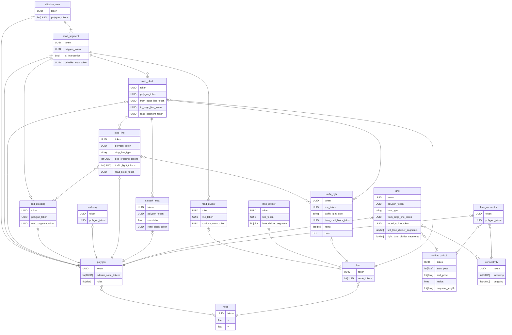

## フォルダ構成とファイル形式

### フォルダ構成
```
root
├─ v1.0-trainval <- メタデータtrainval（nuScenes本体のため省略）
├─ samples <- キーフレームのセンサデータ（nuScenes本体のため省略）
├─ sweeps <- キーフレーム以外のセンサデータ（nuScenes本体のため省略）
└─ maps
    :
    ├─ basemap <- Map Expansionのマップ高精細画像 (.png)
    |   ├─ boston-seaport.png
    |   ├─ singapore-hollandvillage.png
    |   ├─ singapore-onenorth.png
    |   └─ singapore-queenstown.png
    ├─ expansion <- Map Expansionのメタデータ (.json)
    |   ├─ boston-seaport.json
    |   ├─ singapore-hollandvillage.json
    |   ├─ singapore-onenorth.json
    |   └─ singapore-queenstown.json
    └─ prediction <- Map Expansionの予測タスクのアノテーション (.json)
        └─ prediction_scenes.json
```

### ファイル形式
各データは以下のファイル形式で保存されている。

|データ種別|ファイル形式|内容|
|---|---|---|
|メタデータ|.json|マップごとのアノテーション情報|
|basemap|.png|ロケーションごとのマップ高精細画像（nuScenes本体のbasemapが白黒であるのに対し、本画像は高精細なLiDAR点群が描画されている）|
|予測タスクのアノテーション|.json|Map Expansionの予測タスクのアノテーション情報|

## メタデータのフォーマット
メタデータはマップごとに以下のJSON形式で保存されている。

```json
{
    "version": "1.3",
    "polygon": [],  // ポリゴンで表されるアノテーション
    "line": [],  // 直線で表されるアノテーション
    "node": [],  // 直線の座標 (座標情報の大半はここに記載される)
    "drivable_area": [],  // 連続して運転可能なエリア
    "road_segment": [],  // 交差点や車線増減ごとに分割された道路エリア
    "road_block": [],  // road_segmentの上下両車線を分割したもの
    "lane": [],  // road_blockを車線ごとに分割したもの
    "ped_crossing": [],  // 横断歩道
    "walkway": [],  // 歩道
    "stop_line": [],  // 停止線ゾーン
    "carpark_area": [],  // 駐車スペース
    "road_divider": [],  // 道路の上下線の境目となる線
    "lane_divider": [],  // 車線の境界線
    "traffic_light": [],  // 信号機
    "canvas_edge": [],  // 地図サイズ
    "arcline_path_3": [],  // 円弧パスで表されるアノテーション
    "connectivity": [],  // ラインの座標
    "lane_connector": [],  // ラインの座標
}
```

|フィールド名|概要|カテゴリ|レコード数 (singapore-onenorth)|
|---|---|---|---|
|version|Map expansionのバージョン|-|-|
|polygon|ポリゴンで表されるアノテーション|-|4886|
|line|直線で表されるアノテーション|-|3845||
|node|点の座標 (座標情報の大半はここに記載される)|-|37740|
|drivable_area|連続して運転可能なエリア|polygon系|1|
|road_segment|交差点や車線増減ごとに分割された道路エリア。交差点自身も含む|polygon系|783|
|road_block|road_segmentの上下両車線を分割したもの|polygon系（エッジはline系）|645|
|lane|road_blockを車線ごとに分割したもの|polygon系（エッジはline系、アークはarcline系）|936|
|ped_crossing|横断歩道|polygon系|120|
|walkway|歩道|polygon系|838|
|stop_line|停止線ゾーン|polygon系|451|
|carpark_area|駐車スペース|polygon系|451|
|road_divider|道路の上下線の境目となる線（中央分離帯は含まず、白線で区切られたもののみを示す）|line系|152|
|lane_divider|車線の境界線|line系|120|
|traffic_light|信号機|line系|127|
|canvas_edge|メートル単位の地図サイズ（H, W）|-|-|
|arcline_path_3|円弧パスで表されるアノテーション (lane, lane_connectorと対応)|arcline系|2002|
|connectivity|arcline_path_3同士の接続を表す|-|2002|
|lane_connector|lane同士の接続パス|polygon系（アークはarcline系）||

アノテーション情報を持つフィールドは、面で表される`polygon系`、線で表される`line系`、円弧で表される`arcline系`にカテゴライズ。それぞれのカテゴリには以下のフィールドが分類されます (laneはline系とarcline系両方のアノテーション情報を持つ)。

- polygon系: drivable_area, road_segment, road_block, lane, lane_connector, ped_crossing, walkway, stop_line, carpark_area
- line系: road_divider, lane_divider, traffic_light（road_block, laneの両エッジもline系に位置付けられる）
- arcline系: lane, lane_connector

JSONの座標情報は基本的に、**マップの左下端を原点としたメートル座標**。**basemap画像は左上端を原点とした1ピクセル=0.1mの座標系**のため、座標を合わせる際は以下の変換が必要。

- 画像のメートル座標に10を掛ける、またはJSONのピクセル座標に0.1を掛ける
- 画像の上下方向を逆にする、またはJSONの上下方向を逆にする

### メタデータの各フィールドの依存関係
references/schemas_mapexpansion.py（SQLAlchemyのスキーマ）も参照すること（traffic_lightのgeomがLineStringではなくPointになっていることに注意）。以下はフィールド間の依存関係を表したER図。



### メタデータの各フィールドの内容とフォーマット

`references/metadata_fields.md`を参照すること

## Map Expansionの座標系
nuScenes Map Expansionのノード・ポリゴン座標は**ローカルメートル座標系**で格納されている。他の座標系との関係は以下の表の通り。

| 座標系 | 単位 | 原点 | 用途 |
|---|---|---|---|
| Map Expansionノード座標 | メートル | マップ左下 | ポリゴン・レーン定義 |
| Ego pose グローバル座標 | メートル | 同上（同一座標系） | 自車位置・アノテーション |
| basemap PNG画像 | ピクセル | 左上 | 背景地図画像 |
| WGS84経緯度 | 度 | — | Deck.gl等の地図サービス |

### basemap PNG画像との対応
basemap PNGは `(0,0)〜(canvas_edge[0], canvas_edge[1])` メートルの範囲全体を画像全体にマッピングしている。ピクセル変換は以下：
px =  x / resolution               # resolution = 0.1 m/px
py = -y / resolution + canvasH_px  # Y軸反転

## UniADのGround Truthとの関係

ユーザーが「UniAD」や「Bench2Drive」に言及した際は`references/uniad_mapexpansion.md`も参照すること
