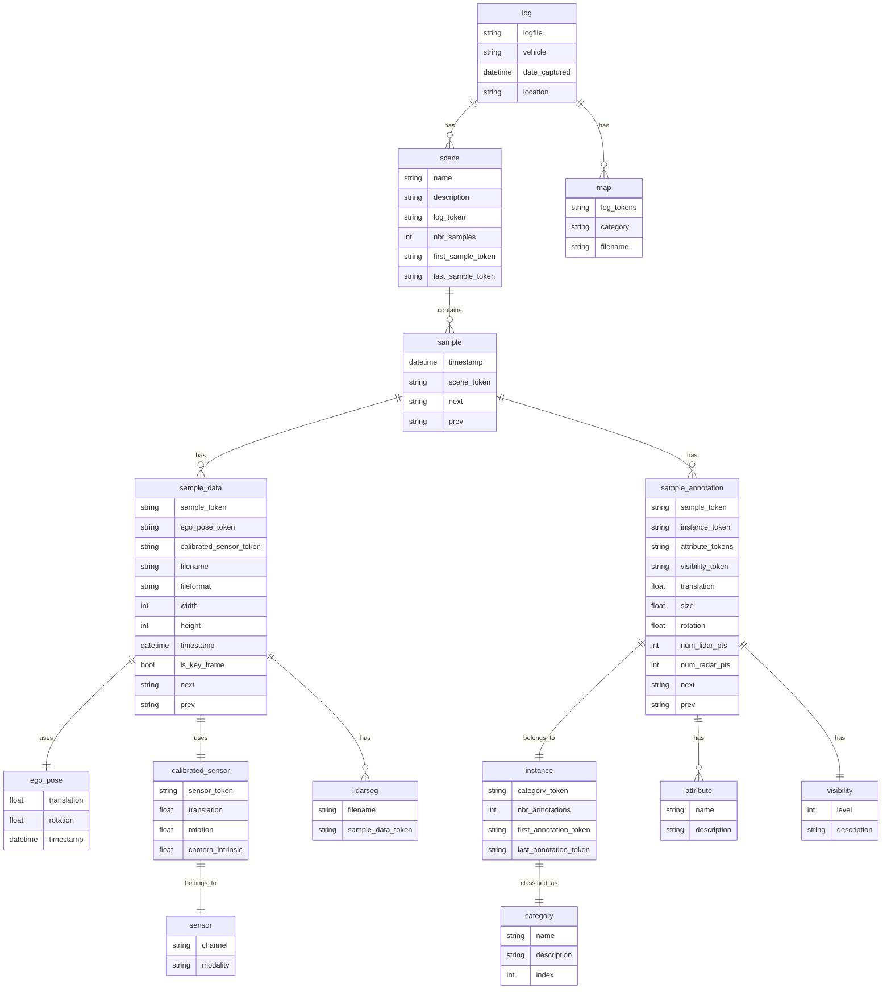

## フォルダ構成とファイル形式

### フォルダ構成
```
root
├─ v1.0-trainval <- メタデータtrainval
|   ├─ scene.json
|   ├─ sample.json
|   ├─ sample_data.json
|   ├─ sample_annotation.json
|   ├─ instance.json
|   ├─ category.json
|   ├─ attribute.json
|   ├─ visibility.json
|   ├─ sensor.json
|   ├─ calibrated_sensor.json
|   ├─ ego_pose.json
|   ├─ log.json
|   └─ map.json
├─ samples <- キーフレームのセンサデータ
|   ├─ CAM_BACK
|   |   ├─ n008-2018-08-01-15-16-36-0400__CAM_BACK__1533151603537558.jpg
|   ├─ CAM_BACK_LEFT
|   ├─ CAM_BACK_RIGHT
|   ├─ CAM_FRONT
|   ├─ CAM_FRONT_LEFT
|   ├─ CAM_FRONT_RIGHT
|   ├─ LIDAR_TOP
|   |   ├─ n008-2018-08-01-15-16-36-0400__LIDAR_TOP__1533151603547590.pcd.bin
|   ├─ RADAR_BACK_LEFT
|   |   ├─ n008-2018-08-01-15-16-36-0400__RADAR_BACK_LEFT__1533151603522238.pcd
|   ├─ RADAR_BACK_RIGHT
|   ├─ RADAR_FRONT
|   ├─ RADAR_FRONT_LEFT
|   └─ RADAR_FRONT_RIGHT
├─ sweeps <- キーフレーム以外のセンサデータ
|   ├─ CAM_BACK
|   ├─ CAM_BACK_LEFT
|   ├─ CAM_BACK_RIGHT
|   ├─ CAM_FRONT
|   ├─ CAM_FRONT_LEFT
|   ├─ CAM_FRONT_RIGHT
|   ├─ LIDAR_TOP
|   ├─ RADAR_BACK_LEFT
|   ├─ RADAR_BACK_RIGHT
|   ├─ RADAR_FRONT
|   ├─ RADAR_FRONT_LEFT
|   └─ RADAR_FRONT_RIGHT
└─ maps
    ├─ 36092f0b03a857c6a3403e25b4b7aab3.png <- boston-seaportのbasemap画像
    ├─ 37819e65e09e5547b8a3ceaefba56bb2.png <- singapore-onenorthのbasemap画像
    ├─ 53992ee3023e5494b90c316c183be829.png <- singapore-hollandvillageのbasemap画像
    ├─ 93406b464a165eaba6d9de76ca09f5da.png <- singapore-queenstownのbasemap画像
    ├─ basemap <- Map Expansionのマップ高精細画像
    |   ├─ boston-seaport.png
    |   ├─ singapore-hollandvillage.png
    |   ├─ singapore-onenorth.png
    |   └─ singapore-queenstown.png
    ├─ expansion <- Map Expansionのメタデータ
    |   ├─ boston-seaport.json
    |   ├─ singapore-hollandvillage.json
    |   ├─ singapore-onenorth.json
    |   └─ singapore-queenstown.json
    └─ prediction <- Map Expansionの予測タスクのアノテーション
        └─ prediction_scenes.json
```

### ファイル形式
各データは以下のファイル形式で保存されている。

|データ種別|ファイル形式|内容|
|---|---|---|
|メタデータ|.json|シーン、サンプル、アノテーションなどのメタ情報|
|basemap|.png|ロケーションごとの地図画像|
|カメラ画像|.jpg|フレームごとの前方・後方カメラ画像など|
|LiDAR|.pcd.bin|float32 × 5列|
|RADAR|.pcd|標準PCD形式、ASCIIまたはbinary|

**RADARのファイル形式詳細**

標準PCD形式（`.pcd`、binary）。LiDARの `.pcd.bin`（float32固定）とは異なり、
フィールドごとにSIZEとTYPEが異なる混在形式：

```
FIELDS x y z dyn_prop id rcs vx vy vx_comp vy_comp is_quality_valid ...
SIZE   4 4 4 1        2  4   4  4 4        4        1               ...
TYPE   F F F I        I  F   F  F F        F        I               ...
```

`SIZE=1` のフィールドは `np.int8`（TYPE=I）または `np.uint8`（TYPE=U）で読む必要がある。
`SIZE=2` は `np.int16`（TYPE=I）または `np.uint16`（TYPE=U）。
`SIZE=4` は `np.float32`（TYPE=F）または `np.int32`（TYPE=I）。
SIZEとTYPEを組み合わせてdtypeを決定しないと全点が0になる。

## メタデータのフォーマット
メタデータはテーブルごとにjson形式で保存されており、以下のファイルに分かれています。

```json
root
├─ v1.0-trainval  <- trainvalデータセットのメタデータ
|   ├─ scene.json
|   ├─ sample.json
|   ├─ sample_data.json
|   ├─ sample_annotation.json
|   ├─ instance.json
|   ├─ category.json
|   ├─ attribute.json
|   ├─ visibility.json
|   ├─ sensor.json
|   ├─ calibrated_sensor.json
|   ├─ ego_pose.json
|   ├─ log.json
|   └─ map.json
├─ v1.0-mini  <- miniデータセットのメタデータ（詳細は省略）
└─ v1.0-test  <- testデータセットのメタデータ（詳細は省略）
```

各テーブルの概要を以下に示します。

||ファイル（テーブル）名|概要|レコード数(mini)|レコード数(trainval)|
|---|---|---|---|---|
|1|scene|シーン（連続した一連の運転データ）の一覧||850|
|2|sample|シーン内のキーフレーム一覧||34,149|
|3|sample_data|センサデータ一覧(キーフレームだけでなく、sweepsのものも含まれる)||2,631,083|
|4|sample_annotation|物体アノテーション(3次元バウンディングボックスと分類ラベル)||1,166,187|
|5|instance|物体インスタンス(複数キーフレームに写る同一の物体)の一覧||64,386|
|6|category|物体カテゴリ(e.g. vehicle, human)||32|
|7|attribute|アノテーションの状態ラベルの一覧(e.g. moving, stopped)||8|
|8|visibility|アノテーションのどれくらいの割合のピクセルがカメラに写っているか||4|
|9|sensor|センサ一覧||12|
|10|calibrated sensor|センサのキャリブレーション情報(キャリブレーションの度に記録される)||10,200|
|11|ego_pose|各キーフレームでの自車の姿勢情報(sample_dataと一対一対応)||2,631,083|
|12|log|ログ（一度の連続した運転単位。シーンの上位概念。車両・マップの紐づけに使える）の一覧||68|
|13|map|マップ情報（紐づくログの一覧の参照が主目的）||4|

### メタデータの各フィールドの依存関係
references/schemas_nuscenes.py（SQLAlchemyのスキーマ）も参照すること。以下はフィールド間の依存関係を表したER図。



### メタデータの各フィールドの内容とフォーマット

`references/metadata_fields.md`を参照すること
